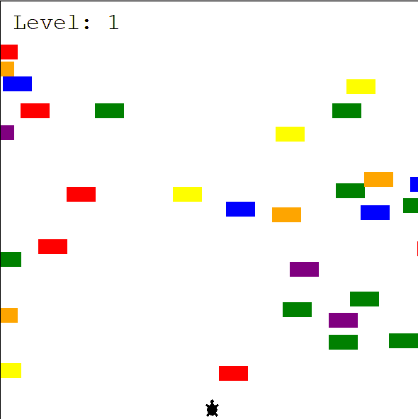

# Turtle Crossing

## Overview

The **Turtle Crossing Road** built with Python.  
Objective: Move the turtle to the other side without letting any object/car hit her.
As the levels progress, the objects/cars get faster.

## Preview



## Features

- Turtle crossing road mechanics
- Increasing difficulty as the turtle crosses the road.
- Level score tracking

## Installation & Run Instructions

To play the game locally:

1. Clone this repository:
   ```bash
   git clone https://github.com/yourusername/snake-game.git
   cd *location of the projects files*
   ```
2. Make sure you have Python 3 installed.
   
4. Make sure you have the turle module installed, if not:
```bash   
pip install pandas
```   
5. Run the game:
   ```bash
   python main.py
   ```
   or
   ```bash
   python3 main.py
   ```
## Requirements

Installed Python 3
Installed module turtle

## License

This project is for educational purposes only
